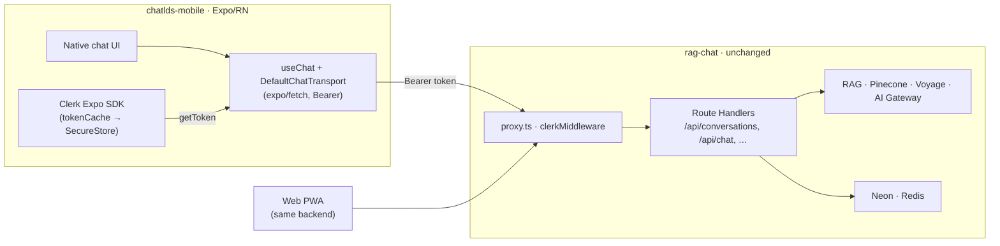

# ChatLDS Mobile App Plan

Status: **active build**. Architecture decided (Expo / React Native). Thin
vertical slice scaffolded at `../chatlds-mobile`. Last updated: 2026-07-21.

> Supersedes the 2026-07-17 Capacitor draft. See
> [Decision & why we flipped](#decision--why-we-flipped-from-capacitor) for the
> rationale.

## Goal

A **native** ChatLDS client for iOS and Android that feels like ChatGPT's own
app — native scroll, keyboard, gestures, streaming, and navigation — not a
website in a shell. The existing Next.js app stays exactly as it is: the hosted
API, RAG engine, auth, persistence, billing, and the web PWA. Mobile is a thin
native client over that finished API.

## Decision & why we flipped from Capacitor

**Chosen: Expo / React Native.** Ship only a native client; share the HTTP API
contract and a small copy of domain types. No shared UI, no monorepo tooling.

The earlier draft chose Capacitor (a WebView wrapping a separately-built web
SPA). Three findings killed that path for a "ChatGPT-grade" bar:

1. **The "reuse the React UI" saving is illusory.** The web UI is Next.js
   Server Components + Route Handlers (`auth()` per request, DB reads in server
   components, dynamic `/chat/[id]`). None of that lifts into a static SPA — the
   draft admitted this. So the client shell gets rebuilt **either way**. Given
   that, rebuild it natively.
2. **A WebView can't hit the feel bar cheaply.** Native scroll momentum,
   keyboard tracking, gestures, and haptics are exactly what makes ChatGPT feel
   good, and exactly what you spend weeks fighting a WebView for. ChatGPT's own
   app is React Native.
3. **Expo deletes the draft's hardest gate.** Native `fetch` is **not** subject
   to CORS (it's a browser policy), so the entire "narrow authenticated CORS
   allowlist" milestone disappears. And Clerk ships a first-class Expo SDK, so
   the auth gate is turnkey rather than a spike.

Net: Expo is **less** total work to reach the target quality, and the backend is
untouched.

## What is reused vs rebuilt

| Layer | Disposition |
| --- | --- |
| RAG, retrieval, tools, prompting | **Reused as-is** (server) |
| Auth (Clerk), billing, persistence, streaming, resume | **Reused as-is** (server) |
| All API Route Handlers | **Reused as-is** — zero backend changes for the happy path |
| Domain types (`SourceType`, request/response shapes) | **Copied** into `chatlds-mobile/lib/api/types.ts` (a handful of fields; extract to a shared package only if it drifts) |
| Chat UI, sidebar, source cards, composer, markdown | **Rebuilt natively** in React Native |

## The three contracts the client speaks

These already exist in the deployed API. The mobile client speaks them verbatim.

### 1. Auth — Clerk bearer token (turnkey)

`src/proxy.ts` is `clerkMiddleware` + `auth.protect()`, which already accepts
`Authorization: Bearer <session-token>`. On the client:

```
const { getToken } = useAuth()          // @clerk/clerk-expo
const token = await getToken()          // short-lived; fetch per request
fetch(url, { headers: { Authorization: `Bearer ${token}` } })
```

`ClerkProvider` + `tokenCache` (backed by `expo-secure-store`) persists the
session. **No backend change.** OAuth (Google/Apple) uses `expo-web-browser` +
app-scheme deep links (`chatldsmobile://`), added in M2.

### 2. Create conversation — `POST /api/conversations`

```
// request
{ language: "eng"|"ita"|…, sources: SourceType[], title?, initialMessage? }
// 201 response
{ id, title, language, sources, …, initialMessageId }
```

Called once on the first submit of a new conversation; returns the
`initialMessageId` the chat turn must reference.

### 3. Streamed turn — `POST /api/chat`

```
{
  conversationId,                 // from step 2
  persistedUserMessageId,         // = initialMessageId from step 2
  language, sources, topK: 20,
  messages: [{ role: "user", parts: [{ type: "text", text }] }]
}
```

Response is the **AI SDK v6 UI Message Stream** (SSE). `useChat` +
`DefaultChatTransport({ fetch: expo/fetch })` parses it natively; text deltas,
tool badges, and `sources`/`details` metadata arrive as message parts.
Resume-after-background is `GET /api/chat/[id]/stream` (resumable-stream),
wired in M2.

## Architecture



## Milestones

### M1 — Thin vertical slice ← **in progress**

Scaffold + prove the two contracts that de-risk everything else.

- Expo Router app at `../chatlds-mobile` (SDK 54, TypeScript). ✅ scaffolded
- `ClerkProvider` + `tokenCache`; email/password sign-in; auth-gated routes.
- One chat screen: create conversation → stream one reply via `useChat`,
  authenticated with a per-request bearer token.
- Config: `EXPO_PUBLIC_CLERK_PUBLISHABLE_KEY`, `EXPO_PUBLIC_API_URL`.

**Exit:** a physical iPhone and Android device sign in and complete one
authenticated streamed turn against the live API, without any backend change.

### M2 — Product parity + native feel

The "ChatGPT clone" work. Rebuild the surfaces natively:

- **Chat**: streaming markdown answers (start plain, then match the web's
  streamdown affordances — code, math, CJK — via an RN markdown renderer),
  stick-to-bottom autoscroll, Stop button, regenerate, copy.
- **Citations & sources**: inline numeric citations → tappable native bottom
  sheet with source cards.
- **Conversations**: native drawer / list screen (list, open, create, rename,
  delete) backed by `/api/conversations`.
- **Lifecycle**: background/foreground recovery via `GET /api/chat/[id]/stream`
  resume; pending/error states; sidebar activity.
- **Memory, response styles, search-scope (Standard/Super), feedback,
  language** — the existing endpoints, native controls.
- **Native-feel checklist** (the bar): keyboard-tracking composer + safe areas,
  momentum scroll, pull-to-refresh, haptics, native share of an answer,
  system light/dark, OAuth sign-in, app-scheme deep links.

**Exit:** critical flows match the PWA and feel native on device.

### M3 — Store & billing readiness

- **Billing decision** (see below). Server-side entitlement reconciliation
  through Clerk stays the source of truth.
- Privacy disclosures, permission copy, icons/splash, store metadata, reviewer
  credentials, release signing.
- Test subscription restore, deep links, offline/error states, upgrade paths.

**Exit:** TestFlight and Play internal-track builds pass review.

## Billing & store policy (decide before M3, not before M1)

Apple/Google require their in-app purchase for digital subscriptions. Two paths:

- **A — Companion for existing subscribers (fastest).** No purchase UI in the
  app at all; Pro is managed on the web. Lowest review friction for TestFlight.
- **B — Native IAP.** StoreKit / Play Billing subscriptions reconciled to Clerk
  entitlements server-side. Use RevenueCat as the lazy cross-platform layer if
  we go here.

Recommendation: ship **A** to TestFlight, decide **B** before public launch.
Do not surface the web Stripe/Clerk checkout inside a store build.

## Toolchain readiness (2026-07-21)

- Node `24.15.0` ✅ (Expo needs ≥18). Run all mobile tooling under Node 24.
- Expo SDK `54`, React Native `0.81`, React `19.1` ✅ scaffolded. **Pinned to 54
  deliberately:** store Expo Go only supports the latest *released* SDK (54), so
  `create-expo-app@latest`'s SDK 57 was rejected as "incompatible" and downgraded.
  Stay on the SDK the target Expo Go supports until moving to development builds.
- Full Xcode: **not installed** (Command Line Tools only) — needed for iOS
  simulator/device builds. `npx expo run:ios` blocked until installed.
- Android Studio / SDK: **not installed** — needed for Android builds.
- Interim: `npx expo start` + **Expo Go** on a physical device runs the JS
  bundle with no native toolchain, enough to exercise M1/M2 on real hardware.

## Location & repo hygiene

`chatlds-mobile` is a **sibling** of `rag-chat`, its own project/git repo — kept
out of `rag-chat` so Vercel never bundles RN deps or `ios/`/`android/` into the
Next deploy. This plan lives with the backend because it is the product plan and
references the exact API contracts above.

## Validation

- Mobile: `npm run lint` / `tsc` inside `chatlds-mobile` (Node 24); on-device
  smoke via Expo Go (the user performs device UI verification).
- Backend: unchanged, so its existing `typecheck` / `build` / `docs:guard` still
  hold. No backend edits are expected for M1.

## Revisit if

The bar drops to "a decent mobile web view is enough" — then the PWA already
covers it and this native client is optional. It does not; ChatGPT-grade feel is
the stated goal, which is native-on-most-screens.
