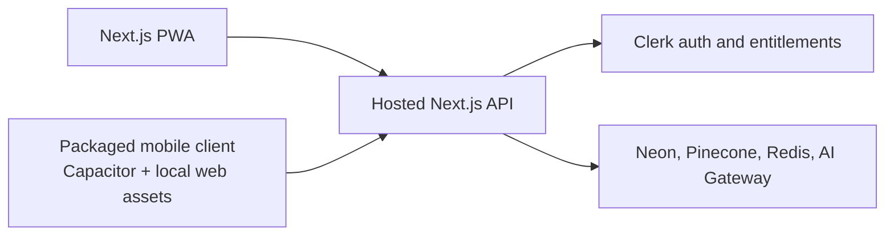

# ChatLDS Mobile App Plan

Status: recommended architecture; proof-of-concept and native projects not yet
started. Last updated: 2026-07-17.

## Decision

Use Capacitor 8 if ChatLDS needs App Store / Play Store distribution or native
device capabilities, but package a local mobile web client. Keep the existing
Next.js application deployed as:

- the installable PWA for browser users;
- the authenticated API, RAG, persistence, billing-entitlement, and streaming
  backend for mobile;
- the desktop and mobile-web product surface.

Do **not** ship a native WebView configured with the deployed site as Capacitor
`server.url`. Capacitor documents that option for live reload, not production,
and Apple requires apps to provide value beyond a repackaged website.

If store distribution and native capabilities are not near-term requirements,
the current PWA remains the lower-cost mobile product and Capacitor should wait.

## Why The Current Next.js Build Cannot Be The Native Bundle

Capacitor copies a static web build from `webDir` into each native project. This
repository's `next build` is intentionally a server deployment, not a static
`out/` export. A direct static export would break load-bearing behavior:

- `auth()` and Clerk protection depend on each incoming request;
- `/chat/[id]` loads an owned conversation and messages from Postgres at request
  time;
- the chat, search, memory, settings, feedback, billing, conversation, and stream
  endpoints use dynamic Route Handlers, including POST and SSE responses;
- `next.config.ts` emits runtime response headers;
- server components load preferences, subscriptions, and conversation state.

Forcing `output: "export"` or setting Capacitor `webDir` to `.next` / `public`
would not produce a functional mobile app.

## Target Boundary

The mobile client should be a small SPA build (recommended location:
`apps/mobile`) that reuses domain types, localization, visual tokens, and pure
chat lifecycle logic where practical. It should not try to import server
components or Next-specific navigation/auth code.

## Proof-Of-Concept Gates

Complete these gates before treating generated `ios/` and `android/` projects as
a production foundation:

1. **Authentication contract**
   - Sign in from a locally packaged origin using the Clerk client SDK.
   - Send a short-lived Clerk token as `Authorization: Bearer ...`.
   - Confirm `clerkMiddleware`, `auth()`, and `auth().has()` preserve the existing
     ownership and plan-entitlement behavior for bearer-authenticated requests.
   - Complete OAuth through universal/app links; do not depend on third-party
     cookies in an embedded remote website.
2. **API and origin contract**
   - Introduce one explicit mobile API base URL.
   - Allow only the exact Capacitor development/production origins needed by iOS
     and Android, and handle preflight requests. Do not add a wildcard authenticated
     CORS policy.
   - Keep browser requests same-origin and cookie-authenticated.
3. **Chat transport**
   - Prove conversation list/open/create and one complete streamed chat turn on
     physical iOS and Android devices.
   - Prove background/foreground recovery, Redis stream resume, source cards,
     citations, regeneration, and failed-request recovery.
4. **Billing and store policy**
   - Do not expose the current Clerk/Stripe checkout inside store builds until a
     store-compliant purchase decision is implemented.
   - Choose either a consumption-only mobile app for existing subscribers or
     native Apple/Google subscription purchases with server-side entitlement
     reconciliation. Validate regional external-purchase exceptions separately.
5. **Native value and review readiness**
   - Select at least one justified native capability (for example native share for
     answers/citations, push notifications, or app-link handoff) and verify that the
     store build is more than a website wrapper.
   - Preserve pinch zoom, rotation, safe areas, 16px mobile input floors, dynamic
     page language, keyboard behavior, and the navigation-safe generation model.

## Delivery Milestones

### M0 — Mobile Web Baseline

- Finish physical iPhone validation for keyboard/visual-viewport behavior.
- Localize the install prompt and address the documented per-message language and
  touch-target gaps where they affect the native client.
- Record repeatable iOS and Android smoke-test cases.

Exit: the current PWA is a trustworthy behavioral reference for the native client.

### M1 — Thin Vertical Slice

- Add an isolated mobile SPA and Capacitor 8 configuration with a real local
  `webDir`; no production `server.url`.
- Implement token auth, narrow CORS, universal/app links, and API-base selection.
- Support sign-in, conversation list, conversation open, and one streamed reply.

Exit: a physical iPhone and Android device can complete the same authenticated
turn without weakening browser auth or API ownership checks.

### M2 — Product Parity

- Add chat lifecycle recovery, sidebar actions, memory, search, response styles,
  citations/sources, feedback, and accessibility parity.
- Gate PWA-only UI (service worker registration and install prompts) out of the
  native client.
- Add native share/app-link behavior and lifecycle telemetry.

Exit: critical user flows match the PWA and pass platform smoke tests.

### M3 — Store And Billing Readiness

- Finalize the purchase model and entitlement reconciliation.
- Add privacy disclosures, permission copy, icons/splash assets, store metadata,
  reviewer credentials, and release signing.
- Test subscription restore, deep links, offline/error states, and upgrade paths.

Exit: TestFlight and Play internal-track builds pass review checklists.

## Current Toolchain Readiness

Checked on 2026-07-17:

- Capacitor packages: current npm release `8.4.2`.
- Node.js: `24.15.0` (meets Capacitor CLI 8's Node `>=22` requirement).
- Full Xcode: not installed (only Command Line Tools are selected).
- Android Studio / Android SDK: not installed or configured.

The repository should not add native projects until the M1 auth/CORS spike is
agreed and the platform toolchains are installed; generated native trees before
that point would be inert churn rather than a working foundation.

## Validation For This Decision

- `npm run typecheck`
- `npm run docs:guard`
- `npm run build`
- Physical-device M0 checklist (to be added before M1)

Revisit the decision if the product requires strongly native UI/interaction on
most screens. In that case, Expo/React Native is a better long-term client even
though it can share only domain logic and API contracts, not the current React UI.
